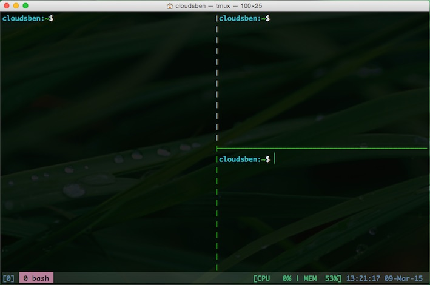

# Bash-git

_Bash-git_ is a bash config for your Mac or Linux

_____

## Prerequisites

* Unix-based operating system (Mac OS X or Linux)
	* If your system is Mac OS X, you‘d better install [Homebrew](http://brew.sh/)
* make sure your system default Shell is Bash shell
* `git` and `tmux` should be installed
* Must be backup your `.bashrc``.profile` and `.tmux.conf` first

## Installation

### Step 1

#### Installation git and tmux

##### on Mac

`brew install git && brew install tmux`

##### on Ubuntu

`sudo apt-get install git && sudo apt-get install tmux`

### Step 2

`git clone https://github.com/cloudsben/bash-git.git .bash-git`

### Step 3

`/bin/bash ./.bash-git/install.sh`

### Step 4

Edit `.gitconfig` change your Name and Email

If you need connect your Server or VPS, Edit `./bash-git/bashrc` for `servers` block

### Step 5

Restart your Shell and enjoy it !

## Tmux key bindings

### Changed

tmux default prefix key binding of `Ctrl+b` changed to `Ctrl+\`

binding of `split-window -h` key is `|`

binding of `split-window -v` key is `-`

### Tmux configuration file

If you want to customize your own tmux configuration file , you can edit this file `.tmux.conf`

## Follow me

[@cloudsben](https://twitter.com/cloudsben)

## Why do I want to build this project

I used to love [oh-my-zsh](https://github.com/robbyrussell/oh-my-zsh) before, but it's to huge and sometimes I'm confused. So I build this project.

## LICENSE

Bash-git is released under the [MIT license](./MIT-LICENSE.txt).
